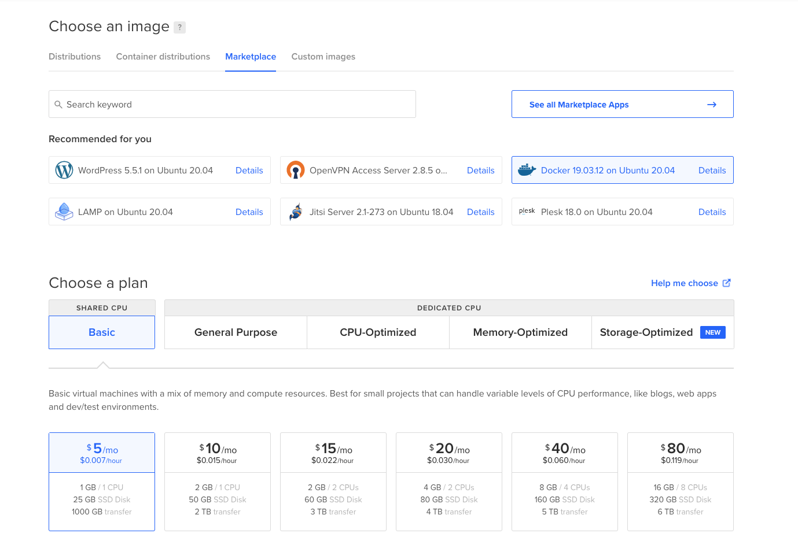

# Digital Ocean

[Digital Ocean](https://www.digitalocean.com/pricing) is a cloud provider offering affordable and easy to setup compute.

> The following guides assumes you have a [Digital Ocean](https://cloud.digitalocean.com) account

## $5 / month

We will be creating a Droplet with Docker already installed.

From the dashboard, click **Create** and select **Droplets**

Under **Marketplace** select **Docker**, **Plan** Basic, and choose the **$5** virtual machine.

You can leave block storage empty, but choose the **Data Center** closest to you.

Under SSH Keys add your public key. 

This is usually under `~/.ssh/id_rsa`. David's Personal Mac being my `id_rsa`.

> To create a new SSH Key, **Settings** → **Security** → **Add SSH Key**

Click **Create Droplet** to create the server.

...

Once the server has been created, you'll want configure the [Digital Ocean dns](https://www.digitalocean.com/community/tutorials/how-to-point-to-digitalocean-nameservers-from-common-domain-registrars) with your domain provider. This will setup the domain you'll be using to point to your new server.

> tldr; **Create** → **Domains/DNS** 

Once you're able to `ssh` into your new server, follow the [getting started](docs/getting-started) to install Krane.
